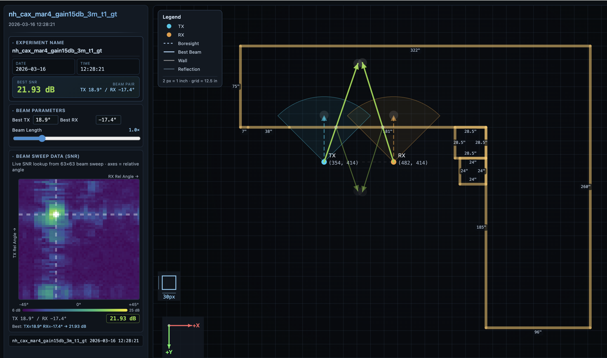

# Ray Tracing Micro Tool

> A lightweight, self-contained toolkit for analyzing and visualizing millimeter-wave (mmWave) beam-sweep measurements — from raw SNR data to interactive floor-plan reports in a single command.


---

## Overview

Ray Tracing Micro Tool processes 63×63 TX/RX beam-sweep data from mmWave antenna experiments and produces two types of output:

| Output | Command | Description |
|--------|---------|-------------|
| **Interactive HTML Report** | `report` | Self-contained browser report with live beam selection, floor plan overlay, SNR heatmap, and specular reflection visualization |
| **Static Heatmap PNGs** | `heatmap` | Publication-quality SNR and incident-angle heatmaps saved as PNG and SVG |

### Example Report

An example experiment and its generated report are included in [`example_experiment/`](example_experiment/).  
Open [`example_experiment.html`](example_experiment/example_experiment.html) directly in a browser to see the tool in action.



---

## File Descriptions

| File | Purpose |
|------|---------|
| [`raytrace.py`](raytrace.py) | **CLI entry point.** The only script you run directly. Accepts two subcommands: `report` (generates the interactive HTML report) and `heatmap` (generates static PNG/SVG heatmaps). Validates inputs and delegates to the modules below. |
| [`generate_report.py`](generate_report.py) | **Report builder.** Reads `snr_data.csv` and `floorplan.json`, finds the best beam pair, and produces a fully self-contained `.html` report with the interactive floor plan, SNR heatmap, beam visualisation, and specular ray tracing — all embedded in one file that runs entirely in the browser. |
| [`plot_heatmap.py`](plot_heatmap.py) | **Static heatmap plotter.** Generates four publication-quality plots: raw Rx power heatmap, SNR heatmap, incident-angle power heatmap, and incident-angle SNR heatmap. Saves as PNG and SVG at 500 dpi. Also contains `LiveHeatmapPlotter` for real-time sweep monitoring. |
| [`floorplan.html`](floorplan.html) | **Visual floor plan editor.** A standalone browser tool for drawing room layouts. Place TX/RX antennas, draw walls, drop shapes, then export a `floorplan.json` that the report generator uses to overlay beam paths on your actual room geometry. |
| [`floorplan.json`](floorplan.json) | **Default floor plan.** Pre-configured for the NH Building 2nd-floor lab. Contains TX/RX pixel coordinates, boresight angles, and all wall segments. Replace or edit this for a different room. |
| [`example_experiment/`](example_experiment/) | **Example dataset.** Contains a real `snr_data.csv` from a 63×63 beam sweep, the generated `example_experiment.html` interactive report, and a heatmap PNG. Open the HTML file in a browser to see the tool output without running anything. |
| [`requirements.txt`](requirements.txt) | Python dependencies: `numpy`, `pandas`, `matplotlib`, `seaborn`. Install with `pip install -r requirements.txt`. |
| [`CREDITS`](CREDITS) | Full attribution — concept, development, and AI assistance. |
| [`LICENSE`](LICENSE) | MIT License. |

---

## Requirements

- Python 3.9 or newer
- One experiment folder containing `snr_data.csv` (see format below)

---

## Installation

```bash
# 1. Clone the repository
git clone https://github.com/apalapramanik/Ray-Tracing-Micro-Tool.git
cd Ray-Tracing-Micro-Tool

# 2. Create and activate a virtual environment (recommended)
python -m venv .venv
source .venv/bin/activate        # macOS / Linux
# .venv\Scripts\activate         # Windows

# 3. Install dependencies
pip install -r requirements.txt
```

---

## Usage

### Generate an interactive HTML report

```bash
python raytrace.py report path/to/my_experiment/
```

The tool will:
1. Read `snr_data.csv` from the experiment folder
2. Load the floor plan (default: `floorplan.json`)
3. Save a self-contained `my_experiment.html` inside the experiment folder
4. Open it automatically in your browser

To specify a custom floor plan:
```bash
python raytrace.py report path/to/my_experiment/ --floorplan path/to/my_floorplan.json
```

### Generate static heatmap PNGs

```bash
python raytrace.py heatmap path/to/my_experiment/
```

With a custom TX boresight angle (degrees, default `0`):
```bash
python raytrace.py heatmap path/to/my_experiment/ --boresight 45
```

Outputs saved inside the experiment folder:
- `<name>_snr_heatmap.png/svg` — SNR heatmap (TX angle × RX angle)
- `<name>_incident_snr_heatmap.png/svg` — SNR mapped by TX incident angle

### Full help

```bash
python raytrace.py --help
python raytrace.py report  --help
python raytrace.py heatmap --help
```

---

## Input Data Format

### What is an exhaustive beam sweep?

An **exhaustive beam sweep** is a measurement procedure in which the TX (transmitter) and RX (receiver) antennas systematically step through every combination of their beam directions. Both antennas used here are phased-array mmWave radios, each capable of forming **63 discrete beams** spanning –45° to +45° in roughly 1.5° steps.

For each of the 63 TX beams, the RX cycles through all 63 of its own beams — yielding **63 × 63 = 3,969 unique TX/RX beam pair measurements**. This exhaustive approach captures the full spatial signature of the channel: which beam directions produce the strongest link, where specular reflections contribute, and how link quality degrades as either antenna steers away from the optimal direction.

The result of one complete sweep is a single `snr_data.csv` file.

---

### `snr_data.csv`

No header row. Four comma-separated columns per measurement:

```
sample_size, tx_beam_index, rx_beam_index, snr_db
2000, 0, 0, 7.094
2000, 0, 1, 7.185
2000, 0, 2, 6.831
...
2000, 62, 62, 8.103
```

| Column | Type | Description |
|--------|------|-------------|
| `sample_size` | integer | Number of IQ samples collected at this beam pair before computing SNR. Higher values give more reliable estimates. Typically 2000. |
| `tx_beam_index` | integer (0–62) | Index of the TX beam direction. Index 0 corresponds to +45° and index 62 to –45°, stepping left to right in ~1.5° increments. |
| `rx_beam_index` | integer (0–62) | Index of the RX beam direction. Index 0 corresponds to –45° and index 62 to +45°, stepping right to left in ~1.5° increments. |
| `snr_db` | float | Signal-to-Noise Ratio measured at this TX/RX beam pair, in decibels (dB). Higher values indicate a stronger, cleaner link. |

A complete sweep contains **3,969 rows** (one per TX/RX beam pair combination).

---

## Floor Plan Setup

The floor plan is a JSON file that tells the tool:
- Where the TX and RX antennas are (pixel coordinates)
- Which direction each antenna faces (boresight angle)
- Where the walls are (as line segments)

### Step 1 — Open the visual editor

Open `floorplan.html` directly in any browser (no server needed):
```
double-click floorplan.html   # macOS / Windows
```

### Step 2 — Draw your room

| Action | How |
|--------|-----|
| Draw a wall | Click **Draw** mode → click start point → click end point |
| Place a shape | Click a shape button (Square, Rect, etc.) → click canvas to drop |
| Edit a wall | Click **Edit** mode → drag endpoints or body |
| Delete a wall | Click **Delete** mode → click any wall |
| Undo last action | Click **Undo** |

### Step 3 — Place TX and RX

In the left panel, find the **TX Position** and **RX Position** sections.  
Enter the X/Y pixel coordinates and boresight angle for each antenna.

**Coordinate system:**
- Origin is wherever you define it (convention: top-left corner of the room)
- Scale: **2 pixels = 1 inch**
- X increases rightward (+X = East)
- Y increases downward (+Y = South)
- Boresight angle: `0°` = facing right/East, `90°` = facing down/South, `270°` = facing up/North

### Step 4 — Export

Click **Save JSON** in the left panel. Save the file anywhere alongside your experiment folders.

### Step 5 — Use it

```bash
python raytrace.py report my_experiment/ --floorplan my_room.json
```

---

### JSON file format (manual editing)

You can also create or edit the JSON file by hand. The format is:

```json
{
  "tx": {
    "x": 354,
    "y": 351,
    "boresight_deg": 270,
    "_label": "optional description"
  },
  "rx": {
    "x": 482,
    "y": 351,
    "boresight_deg": 270,
    "_label": "optional description"
  },
  "walls": [
    { "ax": 200, "ay": 200, "bx": 844, "by": 200, "_label": "Top wall" },
    { "ax": 200, "ay": 200, "bx": 200, "by": 520, "_label": "Left wall" }
  ]
}
```

| Field | Description |
|-------|-------------|
| `tx.x`, `tx.y` | TX antenna position in pixels (2 px = 1 inch) |
| `tx.boresight_deg` | Direction TX faces: 0=East, 90=South, 180=West, 270=North |
| `rx.x`, `rx.y` | RX antenna position in pixels |
| `rx.boresight_deg` | Direction RX faces |
| `walls[].ax/ay` | Wall start point (pixels) |
| `walls[].bx/by` | Wall end point (pixels) |
| `_label` | Optional human-readable description, ignored by the tool |

The included `floorplan.json` is pre-configured for the NH Building 2nd-floor lab.  
**Create a new floor plan before running experiments in a different space.**

---

## Output Structure

```
my_experiment/
├── snr_data.csv                          ← input (required)
├── my_experiment.html                    ← interactive report
├── my_experiment_snr_heatmap.png/svg     ← TX/RX angle SNR heatmap
└── my_experiment_incident_snr_heatmap.png/svg
```

---

## Troubleshooting

| Symptom | Solution |
|---------|----------|
| `ModuleNotFoundError` | Run `pip install -r requirements.txt` |
| `snr_data.csv not found` | Verify the folder path passed to the command |
| Report opens blank | Confirm `snr_data.csv` has 3,969 rows (63×63 beam pairs) |
| Floor plan not showing | Use `--floorplan` or verify `floorplan.json` is present |

---

## License

This project is licensed under the [MIT License](LICENSE).

---

## Acknowledgements

This tool was conceived and initiated by **Dr. Mehmet C. Vuran** (University of Nebraska–Lincoln) as part of ongoing mmWave propagation research.

Development and implementation by **Apala Pramanik**, with assistance from **[Claude](https://claude.ai)** by Anthropic.

---

<sub>© 2025 Apala Pramanik · Concept by Dr. Mehmet C. Vuran (University of Nebraska–Lincoln) · Built with Claude by Anthropic · All rights reserved.</sub>
